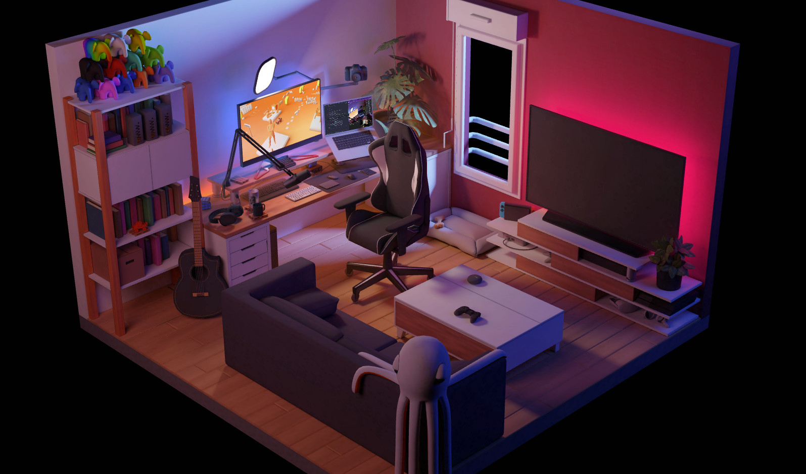
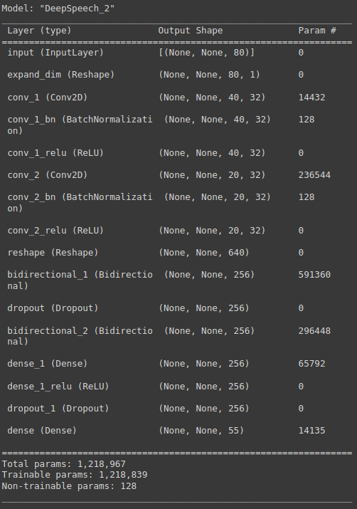

# Smart Room Simulator
<a href="https://colab.research.google.com/github/thanhtvt/SmartRoomSimulator/blob/8efd949f484f8bdedd0a40932d2f1adcc9a02cd7/notebooks/SmartRoomSimulator.ipynb"></a>

Table of Contents
================
* [Abstract](#abstract)
* [Dataset](#dataset)
    * [Feature extraction](#feature-extraction)
    * [Data augmentation](#data-augmentation)
    * [Label processing](#label-processing)
* [Training](#training)
* [Result](#result)
* [Deployment](#deployment)
* [Reference](#reference)


Abstract
========
As technology develops, smart home solutions are increasingly improved and more modern, including Vietnamese voice control solution for smart home devices. We decided to build a website to demo the voice-controlled virtual home that looks like the image below



This repository is 1 of 3 repositories submitted for our assignment for Course: Speech Processing (INT3411 20), where we attempt to use CTC [[1]](#1) for Speech recognition task and deploy a web 3D application.  
  
You can take a look at our other repos for more details:
- Backend: https://github.com/chnk58hoang/SpeechRecognittionBackend/
- Frontend (Main): https://github.com/hahoang1903/SP-Project
 

Dataset
=======

Our dataset contains 18 different commands to control 6 objects in our 3D simulated room. There are 4 main speakers (the other are our friends), each of us record 60-70 utterances per command. That makes our dataset comprising of around 5000 utterances, which are about 1.5 hours of recording. All of our data are self-recorded and later converted to 16kHz of sampling rate and 16-bit.

We publish our cleaned dataset [here](https://drive.google.com/file/d/1OIGRepslXXJXLjJchs_uPac86MGTIxHe/view?usp=sharing), if you want to use it to toy with our repository.
   
Feature extraction
------------------
  
From the raw waveform, we decide to take FilterBank as our feature to use as the input of our machine learning model. There are two main reasons for this:
- We saw many papers use FBank as their features to benchmark their SOTA models. All of them produce great resutls.
- We want to have higher dimension for our input. With FBank, we can have up-to 80 (or even more) mel bins to put in our model. Whereas with MFCC, we can only extract about 13 to 39 (combination MFCC, delta MFCC and delta-delta MFCC) MFCCs, which is lower than FBank. 

More about this, please check out this [answer](https://stackoverflow.com/questions/60439741/why-do-mel-filterbank-energies-outperform-mfccs-for-speech-commands-recognition).


Data augmentation
-----------------

As we only have around 1.5 hours of speech dataset, we have to do some augmentation technique to increase our number of samples for training, validating and testing. Our augmentation techniques are listed below:

- **Audio augmentation**:
    + `Gain`: Multiply the audio by a random amplitude factor to reduce or increase the volume.
    + `Time stretch`: Time stretch the signal by a random factor (without changing the pitch)
    + `Pitch shift`: Pitch shift the sound up or down.

- **Feature augmentation**: We use SpecAugment [[3]](#3) as it is simple but effective.

Also, thank to phrasenmaeher [[4]](#4) for the amazing tool. It helped us a lot in order to choose the right augmentation technique for our problem.


Label processing
----------------

As computer cannot understand a character or a string, we have to encode them to numbers. Here, we are using Byte Pair Encoding [[5]](#5) as our subword algorithm (we set `vocab_size` equal 54 in this case). We utilize the famous SentencePiece [[6]](#6) for this purpose.


Training
========
As our dataset is pretty simple, we do not use entirely but simplify DeepSpeech 2 [[2]](#2) as the encoder. Comparing to their smallest version (about 35M parameters), our only have 1.2M parameters and still achieve great results. Details about our model, please check source code or notebook.

<p align="center"></p>

🚀 To recreate our experiments, train a model with specific configuration, please check out our [notebook](notebooks/SmartRoomSimulator.ipynb) or run:

```shell
$ python train.py [-h] [-d DEVICES] config_file

positional arguments:
  config_file           Path to a yaml file using the extended YAML syntax

optional arguments:
  -h, --help            show this help message and exit
  -d DEVICES, --devices DEVICES
                        Devices for training, separated by comma
```

We have already provided the configuration template [here](egs/v1/config.yaml) so it is easier for you to execute command above.

Result
======
After training for about 70 epochs, we managed to reduce CTC loss of training set to 1.55 and CTC loss of validation set to 1.42, which is 2.13% WER (Word Error Rate) on the validation set and only around lower than 1% WER on the test set (around 457 samples).

Deployment
=========
For deployment, please check out our [main repository](https://github.com/hahoang1903/SP-Project) for more details.

Reference
============
<a id="1">[1]</a> 
Sequence Modeling with CTC: https://distill.pub/2017/ctc/

<a id="2">[2]</a>
Amodei, Dario, et al. "Deep speech 2: End-to-end speech recognition in english and mandarin." International conference on machine learning. PMLR, 2016.
  
<a id="3">[3]</a>
Park, Daniel S., et al. "Specaugment: A simple data augmentation method for automatic speech recognition." arXiv preprint arXiv:1904.08779 (2019).

<a id="4">[4]</a> 
Visualize audio transformations with streamlit: https://github.com/phrasenmaeher/audio-transformation-visualization

<a id="5">[5]</a> 
Wikipedia contributors. "Byte pair encoding." Wikipedia, The Free Encyclopedia. Wikipedia, The Free Encyclopedia, 29 Jan. 2022. Web. 21 Jun. 2022.

<a id="6">[6]</a> 
Kudo, Taku, and John Richardson. "Sentencepiece: A simple and language independent subword tokenizer and detokenizer for neural text processing." arXiv preprint arXiv:1808.06226 (2018).
